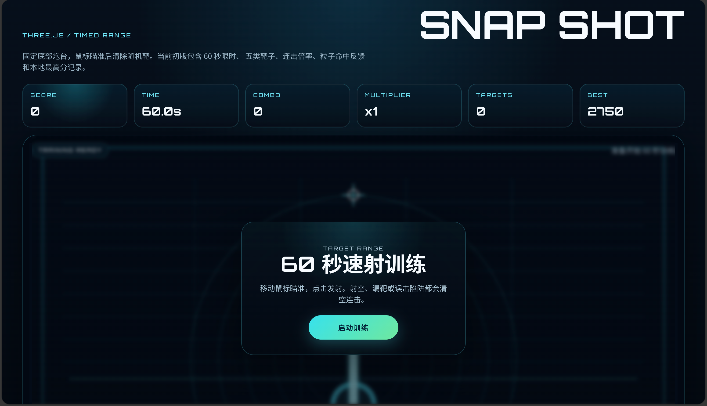
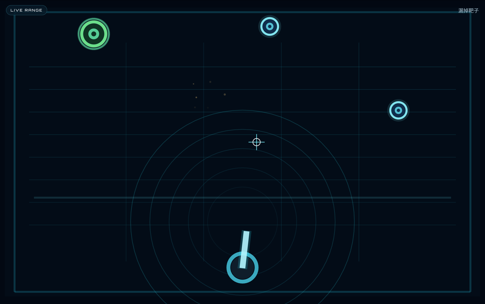

# Snap Shot

一个基于 `React + TypeScript + Three.js + Vite` 的 2D 街机反应射击游戏原型。

玩家控制屏幕底部中央的固定炮台，鼠标移动负责瞄准，点击发射子弹，清除随机出现的靶子并在 60 秒内尽可能打出更高分数与连击。

## 当前版本

这是一个已经可玩的 MVP / 初步版本，已实现完整的单局循环：

- 固定炮台
- 鼠标瞄准
- 点击射击
- 随机靶生成与消失
- 60 秒限时模式
- 分数、连击、倍率、本地最高分
- 全屏启动
- `Esc` / 退出全屏暂停，并提供“继续训练”或“结束本局”

## 游戏特性

- `Three.js` 正交相机实现的 2D 训练场景
- 五类靶子：普通靶、大型靶、快闪靶、小型高分靶、陷阱靶
- 基础连击倍率系统
- 命中粒子、分数字样、枪口火焰、轻微后坐反馈
- 本地 `localStorage` 保存最高分

## 操作说明

- `鼠标移动`：瞄准炮口方向
- `鼠标左键`：发射子弹
- `启动训练`：进入全屏并开始游戏
- `Esc`：退出全屏后进入暂停态
- `继续训练`：重新进入全屏并恢复
- `结束本局`：直接结算当前分数

## 技术栈

- `React 19`
- `TypeScript`
- `Three.js`
- `Vite`
- `ESLint`

## 本地运行

建议使用较新的 Node.js 版本。

```bash
npm install
npm run dev
```

默认开发地址通常为：

```text
http://localhost:5173
```

## 构建与检查

```bash
npm run build
npm run preview
npm run lint
```

## 在线预览

[点击预览 Demo](https://sobigrice.github.io/snapshot/)

## 项目结构

```text
.
├── src/
│   ├── components/
│   │   └── SnapshotGame.tsx   # 核心游戏逻辑与 Three.js 场景
│   ├── App.tsx                # 页面入口
│   ├── App.css                # 游戏 UI 样式
│   └── index.css              # 全局样式
├── 需求说明书.md               # 玩法需求说明
├── 2d_target_shooter_design.md # 设计补充文档
└── README.md
```

## 开发说明

当前实现重点是先打通“可玩”闭环，后续仍有不少可以继续扩展的方向：

- 移动靶
- 更多模式，例如生存模式、连击挑战
- 音效与背景音乐
- 更丰富的 UI 动效与命中特效
- 排行榜与成绩持久化
- 进一步优化包体体积

## 文档

- [需求说明书](./需求说明书.md)

## 预览




本仓库已附带 `MIT` 许可证，见 [LICENSE](./LICENSE)。

## Contributing

欢迎提交 Issue 和 PR，用于：

- 调整玩法节奏
- 修复碰撞或 UI 问题
- 增加新的靶子与模式
- 优化渲染与代码结构
